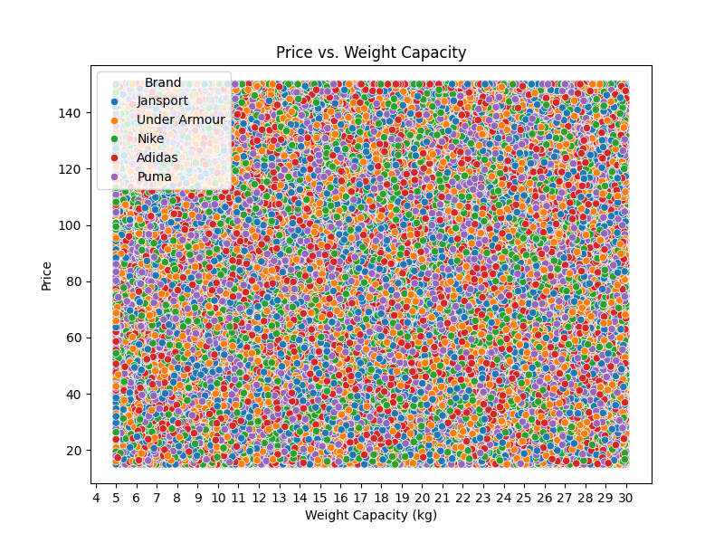
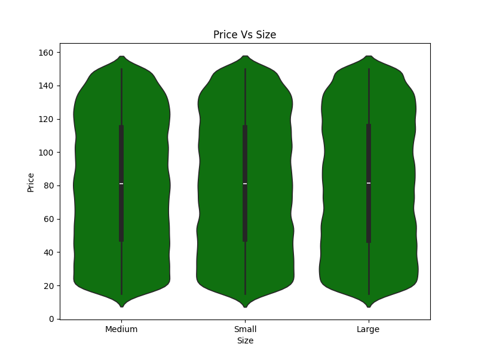
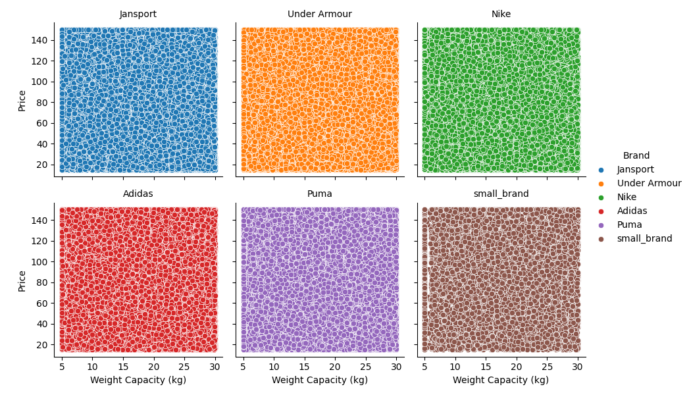
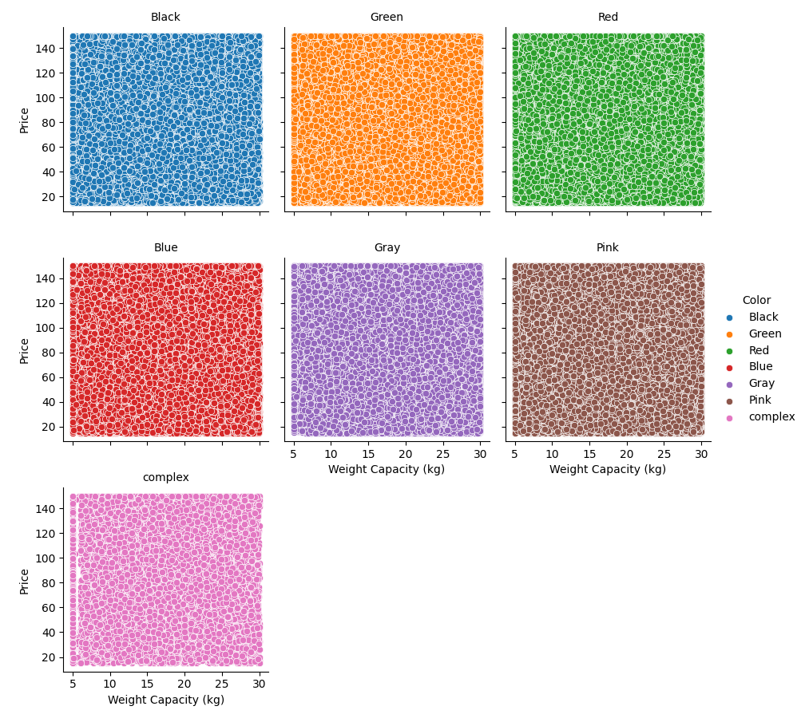
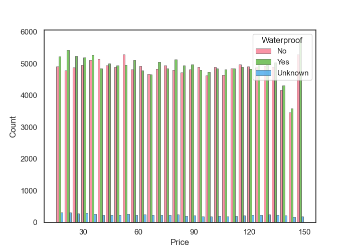
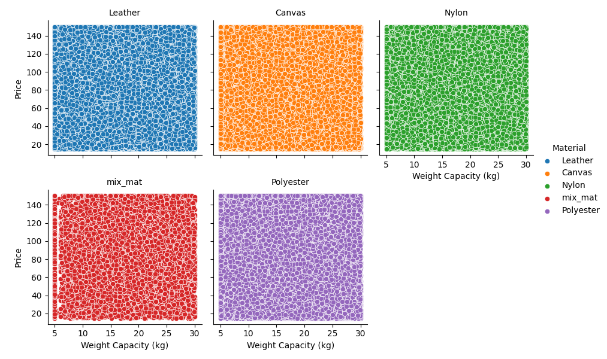
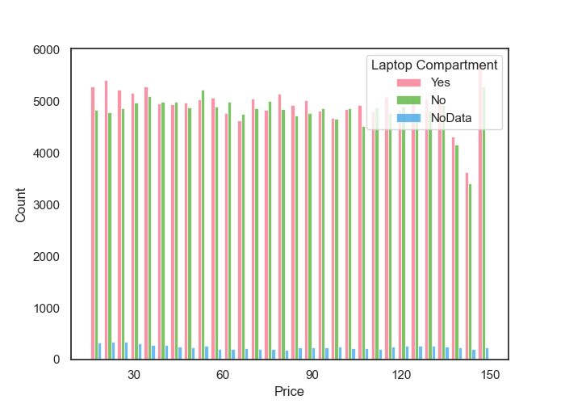

# Analysis of Backpack Price Prediction Challenge: Evidence of Randomly Generated Data 

Kaggle Playground Series - Season 5, Episode 2
[Walter Reade and Elizabeth Park. Backpack Prediction Challenge, 2025. Kaggle.]( https://kaggle.com/competitions/playground-series-s5e2)

**Executive Summary:**

This report details an investigation into the "Backpack Prediction Challenge" dataset, aimed at predicting backpack prices using various features. Analysis revealed a significant anomaly: backpack prices appear to be randomly distributed, with no discernible correlation to provided features (brand, material, size, style, color, compartments, weight capacity, waterproof, laptop compartment). Despite employing multiple regression models (linear regression, XGBoost, KNN), consistent Root Mean Squared Error (RMSE) values around 39 were observed, indicating a lack of predictive power. This aligns with the dataset creator's confirmation that the data was generated using a simple random process, rendering it unsuitable for meaningful predictive modeling.

*Figure 1: Price Vs Weight (hue= Brands): All the backpacks in a scatter figure of Price Vs Weight Capacity, with hue representing the Brands.*

[^1]:

**1. Introduction:**

The "Backpack Prediction Challenge" presented a dataset with 300,000 training and 200,000 test entries, featuring categorical, boolean, and numerical attributes of backpacks. The objective was to predict the 'Price' variable using these features.

**2. Data Exploration and Initial Observations:**

* **Price Distribution:** Initial exploration revealed a limited price range (15-150) with an unusual uniformity across categories like 'Size' (small, medium, large). Violin plots confirmed a consistent price distribution across these categories.

*Figure 2: Violin Price Vs size: kde of the price distribution by size, the small, the medium and large bags have similar price distribution.*

* **Feature Analysis:** Scatter plots of 'Price' against numerical features (Compartments, Weight Capacity) and categorical features (Brand, Material, Color) showed a uniform, scattered distribution, suggesting no clear relationships.

*Figure 3: Price Vs Weight Capacity for different brands*

*Figure 5: Price Vs Weight Capacity for different colors*

* **Histogram Analysis:** Histograms of 'Price' segmented by boolean features (Waterproof, Laptop Compartment) also demonstrated a lack of distinct patterns.

*Figure 6: Number of backpack for that price to find if there a diference in Waterproof*

**3. Model Evaluation and Results:**

* Multiple regression models were implemented:
    * Linear Regression: RMSE = 38.94273
    * XGBoost Regression: RMSE = 38.92103
    * KNN Regression: RMSE = 38.94863
* All models produced similar, high RMSE values, approximately 39.
* Given the price range of 135, an RMSE of 39 indicates that the model's error is roughly half of the entire possible price range, effectively rendering the predictions meaningless.
* The best score on the competition was 38.61628, indicating that everyone was having the same problem.

**4. Visual Evidence:**

* Scatter plots of 'Price' vs. 'Weight Capacity' (segmented by Brand, Material, Color) showed a uniform distribution across the entire price range, lacking any discernible clusters or trends.

*Figure 4: Price Vs Weight Capacity for different materials*

* Histograms of price vs the boolean values showed very similar distributions.

*Figure 7: Number of backpack for that price to find if there a diference in Laptop Compartment*

**5. Interpretation and Conclusion:**

* The consistent, high RMSE values across various models, combined with the uniform distribution of 'Price' across all features, strongly suggests that the data is randomly generated.
* This conclusion is supported by the dataset creator's confirmation [Code I used to create this dataset 6 months back](https://www.kaggle.com/code/souradippal/code-i-used-to-create-this-dataset-6-months-back/notebook).
* Therefore, the dataset is not suitable for predictive modeling.
* The data set is not usefull for predictive analysis.
* It is important that data sets are generated with real world relationships in mind.

**6. Recommendations:**

* This exercise reminds us that we must understand the data, rather than merely coding it into the computer to seek unnecessary solutions that consume too much time. A data scientist needs to know when to stop.

`Last update as of March 02, 2025`
